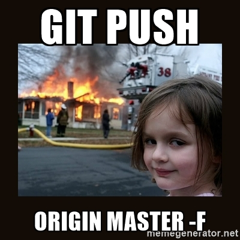
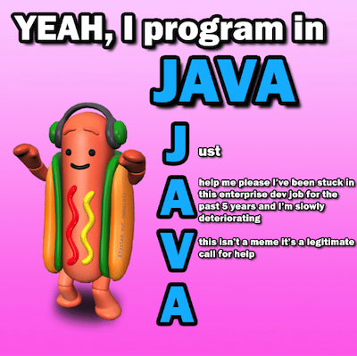

Spaceport
=========

This project was bootstrapped with [Create React App](https://github.com/facebook/create-react-app).

## Available Scripts

In the project directory, you can run:

### `npm start`

Runs the app in the development mode. 
Open [http://localhost:3000](http://localhost:3000) to view it in the browser.

The page will reload if you make edits. 
You will also see any lint errors in the console.

### `npm test`

Launches the test runner in the interactive watch mode. 
See the section about [running tests](https://facebook.github.io/create-react-app/docs/running-tests) for more information.

### `npm run build`

Builds the app for production to the `build` folder. 
It correctly bundles React in production mode and optimizes the build for the best performance.

The build is minified and the filenames include the hashes. 
Your app is ready to be deployed!

See the section about [deployment](https://facebook.github.io/create-react-app/docs/deployment) for more information.

### `npm run eject`

**Note: this is a one-way operation. Once you `eject`, you can’t go back!**

If you aren’t satisfied with the build tool and configuration choices, you can `eject` at any time. This command will remove the single build dependency from your project.

Instead, it will copy all the configuration files and the transitive dependencies (Webpack, Babel, ESLint, etc) right into your project so you have full control over them. All of the commands except `eject` will still work, but they will point to the copied scripts so you can tweak them. At this point you’re on your own.

You don’t have to ever use `eject`. The curated feature set is suitable for small and middle deployments, and you shouldn’t feel obligated to use this feature. However we understand that this tool wouldn’t be useful if you couldn’t customize it when you are ready for it.

## Things You Probably Shouldn't Do

### Pusing directly to master

This is how to get fired from an internship in a single command: `git push origin master -f`.

This is one of the only ways in Git that you can overwrite and/or destroy other people's work.

The correct thing to do is to create a branch, work on that branch, then merge that branch via a pull request.

### Not writing unit tests

If you don't write automated tests, nobody else will know if your code works or not.

### Not writing documentation

If you don't document your code, nobody will know what you were thinking. There's also a decent change you will forget if you leave the code alone for a few weeks.

### Get sucked into the enterprise development world

[Checkout Steve Ballmer of Microsoft talk about developers](https://www.youtube.com/watch?v=Vhh_GeBPOhs).

## Learn More

You can learn more in the [Create React App documentation](https://facebook.github.io/create-react-app/docs/getting-started).

To learn React, check out the [React documentation](https://reactjs.org/).

### Past Contributors ###

Add your name here if you're committing changes to this repository.

- [Jake Billings](https://jakebillings.com)
